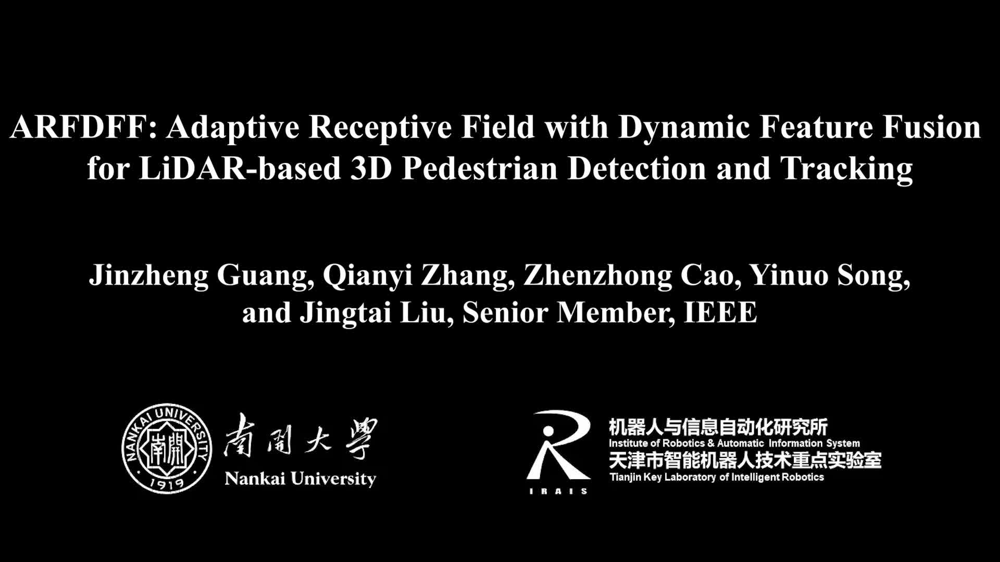
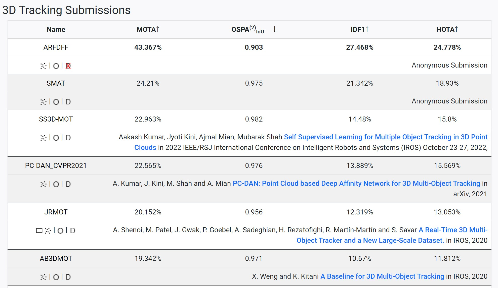
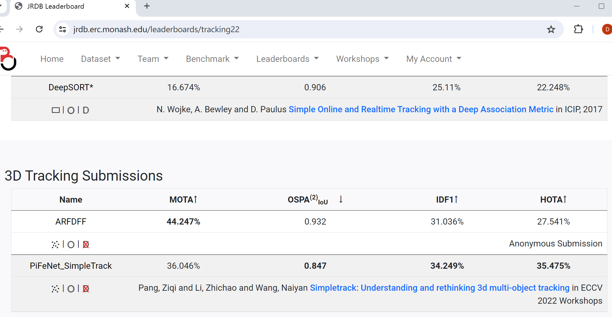
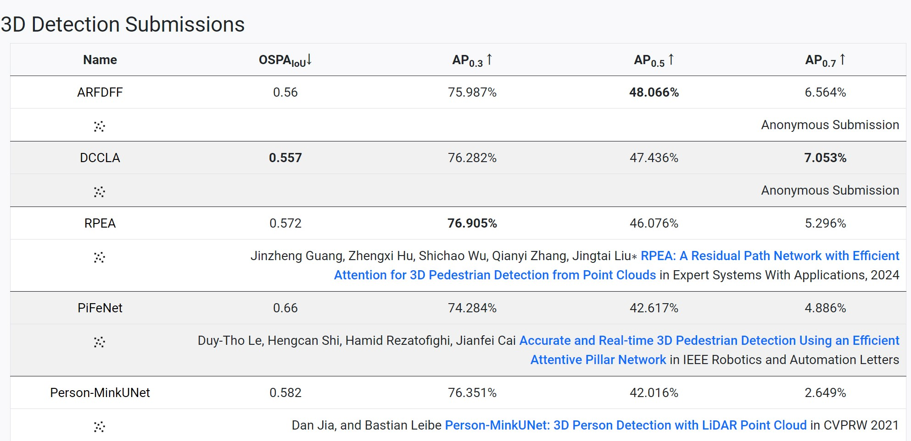
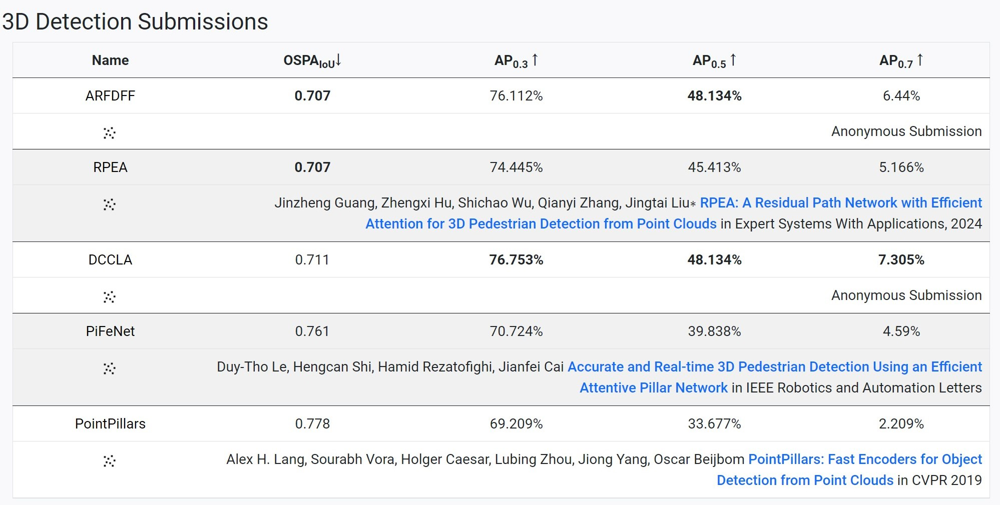

# ARFDFF

Official PyTorch implementation of ARFDFF: Adaptive Receptive Field with Dynamic Feature Fusion for LiDAR-based 3D Pedestrian Detection and Tracking.

## Experimental Results

### 3D Pedestrian Detection

Our ARFDFF ranks first on [JRDB 2022](https://jrdb.erc.monash.edu/leaderboards/detection22) and [JRDB 2019](https://jrdb.erc.monash.edu/leaderboards/detection) 3D pedestrian detection leaderboards.

|           Model           | AP (JRDB 2022) | AP (JRDB 2019) | 
|:-------------------------:|:--------------:|:--------------:|
| [RPEA](https://github.com/jinzhengguang/RPEA)   |    45.413%     |    46.076%     | 
|           ARFDFF           |    48.134%     |    48.066%     | 
|        Improvement        |    +2.721%     |    +1.990%     | 

### 3D Pedestrian Tracking

Our ARFDFF ranks first on [JRDB 2022](https://jrdb.erc.monash.edu/leaderboards/tracking22) and [JRDB 2019](https://jrdb.erc.monash.edu/leaderboards/tracking) 3D pedestrian Tracking leaderboards.

|                      Model                      | MOTA (JRDB 2022) |                     Model                      | MOTA (JRDB 2019)  | 
|:-----------------------------------------------:|:--------------:|:----------------------------------------------:|:-----------------:|
| [PiFeNet SimpleTrack](https://github.com/ldtho/PiFeNet)  |    36.046%    | [SMAT](https://sites.google.com/view/smat-nav) |      24.210%      | 
|                     ARFDFF                      |    44.247%     |                     ARFDFF                     |      43.367%      | 
|                   Improvement                   |    +8.201%     |                      Improvement               |  +19.157%     | 

## News

- **(2024-xx-xx)** 🔥 We will release the code and model after the paper is accepted.

- **(2024-06-04)** 🏆 Our ARFDFF ranks first on [JRDB 2019 3D Pedestrian Tracking Leaderboard](https://jrdb.erc.monash.edu/leaderboards/tracking).

- **(2024-06-04)** 🏆 Our ARFDFF ranks first on [JRDB 2022 3D Pedestrian Tracking Leaderboard](https://jrdb.erc.monash.edu/leaderboards/tracking22).

- **(2024-05-28)** 🏆 Our ARFDFF ranks first on [JRDB 2019 3D Pedestrian Detection Leaderboard](https://jrdb.erc.monash.edu/leaderboards/detection).

- **(2024-05-28)** 🏆 Our ARFDFF ranks first on [JRDB 2022 3D Pedestrian Detection Leaderboard](https://jrdb.erc.monash.edu/leaderboards/detection22).

## Acknowledgement

- RPEA [(link)](https://github.com/jinzhengguang/RPEA)
- Person_MinkUNet [(link)](https://github.com/VisualComputingInstitute/Person_MinkUNet)
- PiFeNet [(link)](https://github.com/ldtho/PiFeNet)
- torchsparse [(link)](https://github.com/mit-han-lab/torchsparse)
- PointRCNN [(link)](https://github.com/sshaoshuai/PointRCNN)

## Contact Information

If you have any suggestion or question, you can leave a message here or contact us directly: guangjinzheng@qq.com. Thanks for your attention!

